<div align="center">


# 🌿 EL FIRMA
### Agricultural Enterprise Management Platform

*A full-stack Symfony 6.4 web application for modern farm management —
from soil to sale, from livestock to logistics.*

<br/>

[](https://php.net)
[](https://symfony.com)
[](https://getbootstrap.com)
[](https://mysql.com)
[](https://python.org)
[](https://firebase.google.com)

[](#-team)
[](https://github.com/YoussefAbbes/Esprit-PIDEV-WEB-3A3-2026-ELFIRMA/commits)

</div>

---

## 📖 Table of Contents

- [About the Project](#-about-the-project)
- [Demo](#-demo)
- [Feature Highlights](#-feature-highlights)
- [Tech Stack](#-tech-stack)
- [System Architecture](#-system-architecture)
- [Quick Start (TL;DR)](#-quick-start-tldr)
- [Getting Started](#-getting-started)
- [Environment Variables](#-environment-variables)
- [Module Overview](#-module-overview)
- [AI & Intelligence](#-ai--intelligence)
- [Machine Learning Models & Datasets](#-machine-learning-models--datasets)
- [Biometric Authentication](#-biometric-authentication)
- [API Integrations](#-api-integrations)
- [Database Schema](#-database-schema)
- [Project Structure](#-project-structure)
- [Running Tests](#-running-tests)
- [Contributing](#-contributing)
- [Team](#-team)
- [License](#-license)

---

## 🌾 About the Project

**EL FIRMA** is a comprehensive, production-grade agricultural enterprise management system built with **Symfony 6.4 LTS**. Born from the need to digitize and modernize farm operations, EL FIRMA brings together every aspect of agricultural business — from managing hectares of land and crop cycles to tracking livestock health, automating supply chains, and leveraging AI-driven insights.

This platform goes far beyond a typical CRUD application. It integrates **biometric authentication** (fingerprint + face ID), a **RAG-powered chatbot**, a **machine-learning crop recommendation engine**, **3D livestock visualization**, **predictive equipment maintenance**, an **interactive training & certification module**, and **real-time SMS / push notifications** — all within a polished, mobile-friendly interface.

> 🎓 Developed as a **PIDEV** (Projet d'Intégration et de Développement) at **ESPRIT School of Engineering** — 3rd Year, Group 3A3, Academic Year 2025–2026.

---

## 🎬 Demo

> 📹 **Demo video:** _add your link here_ (YouTube / Google Drive)
> 🌐 **Live deployment:** _Not available (run locally — see [Quick Start](#-quick-start-tldr))_

### 🧑‍🌾 Client / Public Experience

| Sign In | Public Home |
|:---:|:---:|
| 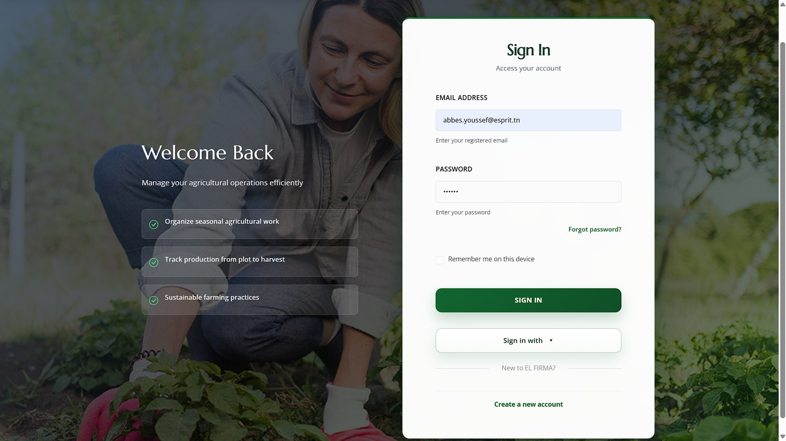 | 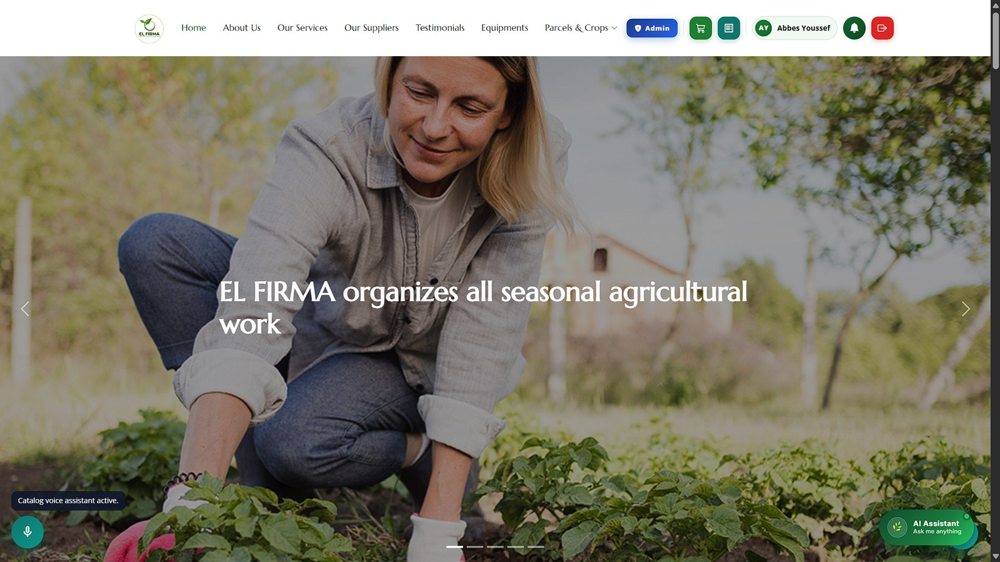 |
| **Product Marketplace** | **Livestock Catalog** |
| 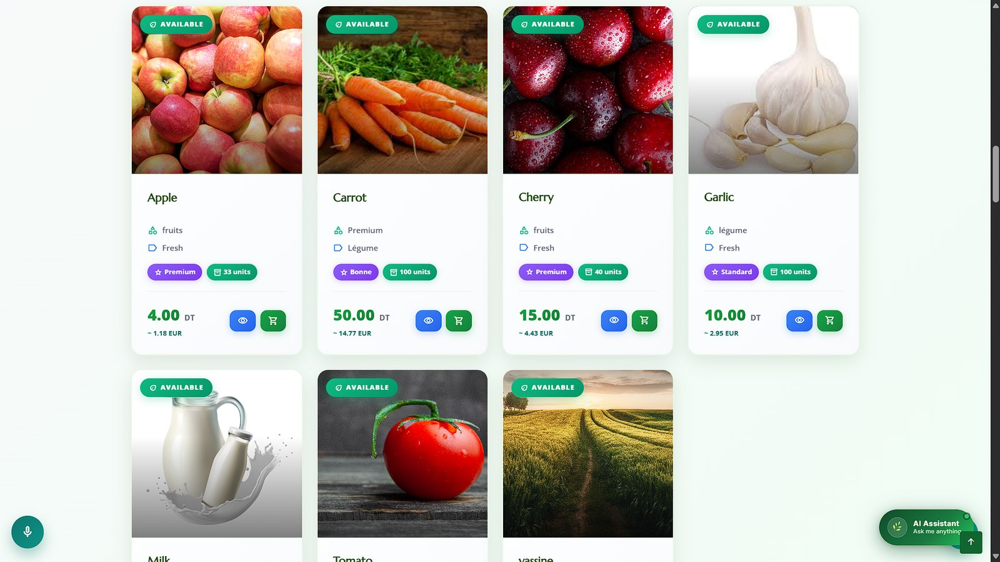 | 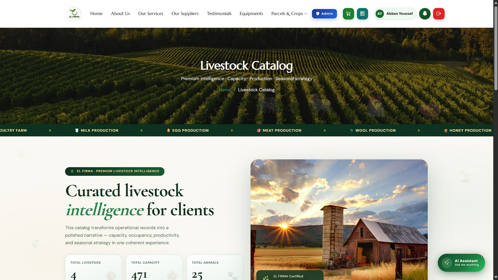 |
| **AI Farm Assistant (RAG Chatbot)** | **Two-Factor Admin Access** |
| 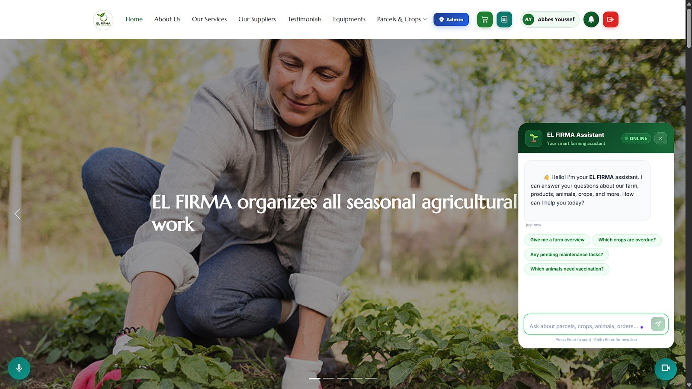 | 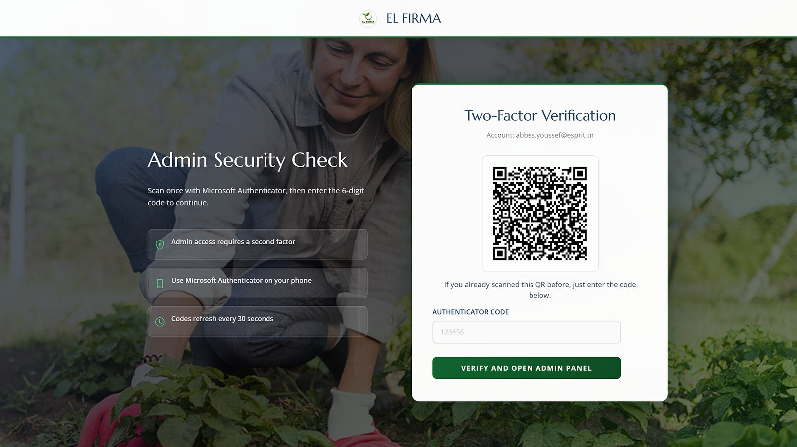 |

### 🖥️ Admin — Management Dashboards

| Main Dashboard | Parcels Management |
|:---:|:---:|
| 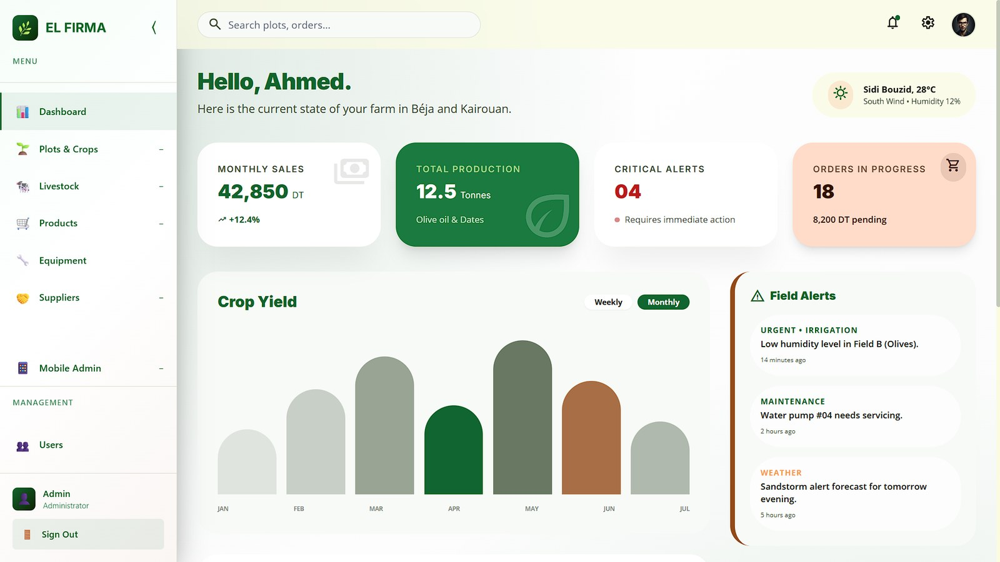 | 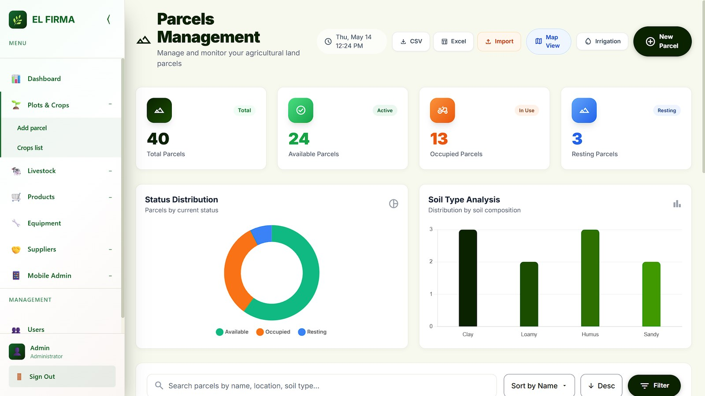 |
| **Crops Management** | **Parcel Detail & Map** |
| 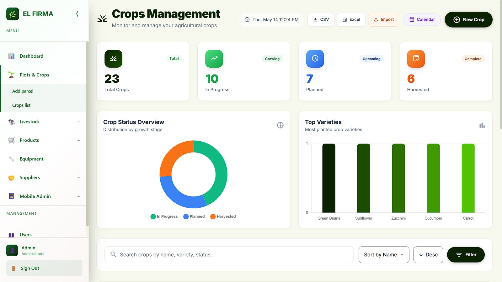 | 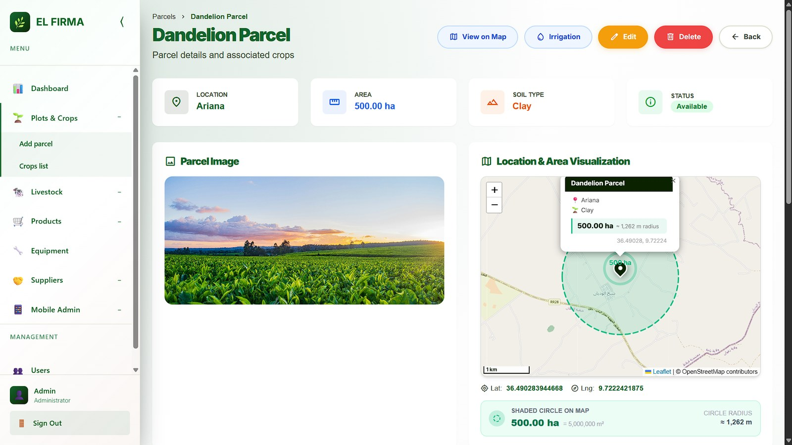 |
| **Animal Management** | **Livestock Capacity** |
| 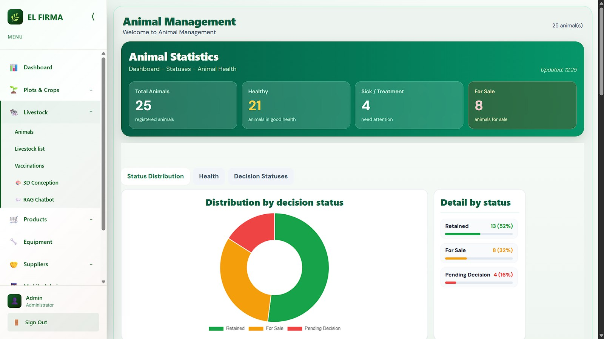 | 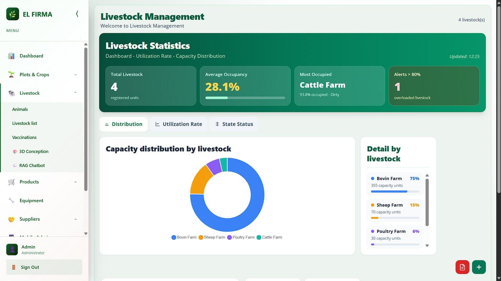 |
| **Products Management** | **Suppliers & Partners** |
| 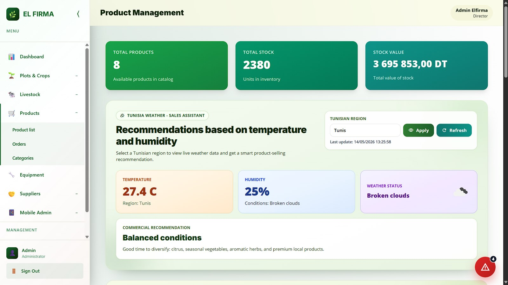 | 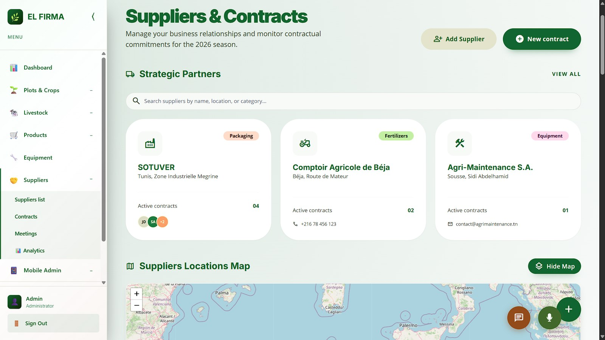 |
| **Contracts Analytics** | **3D Livestock Habitat Studio** |
| 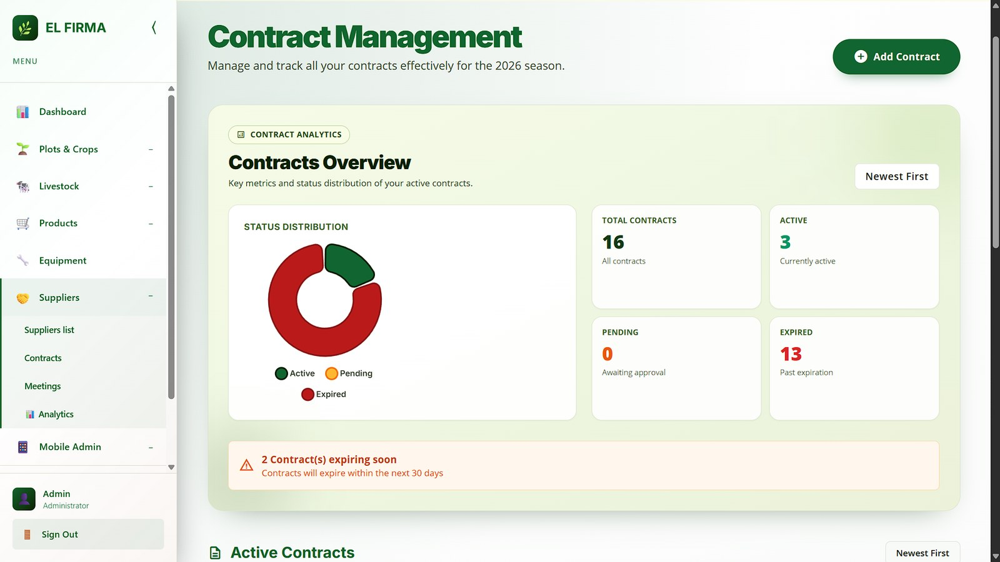 | 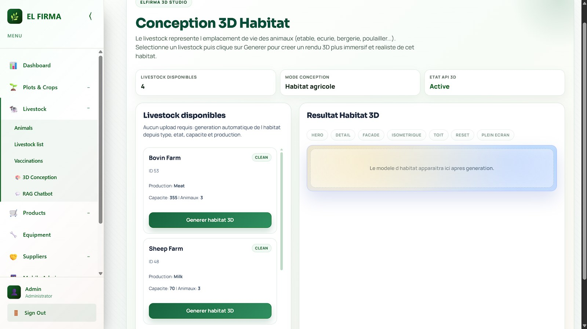 |

### 🎓 Training & Certification

| Training Dashboard | Interactive Lesson |
|:---:|:---:|
| 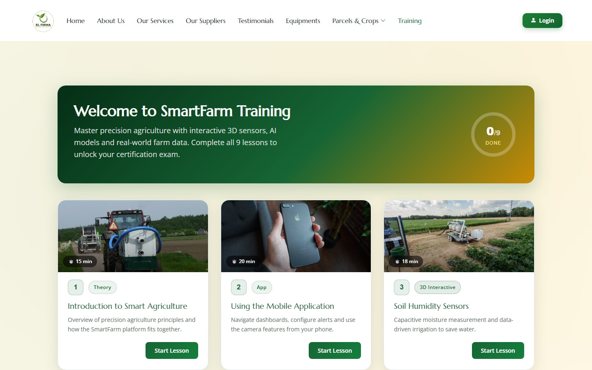 | 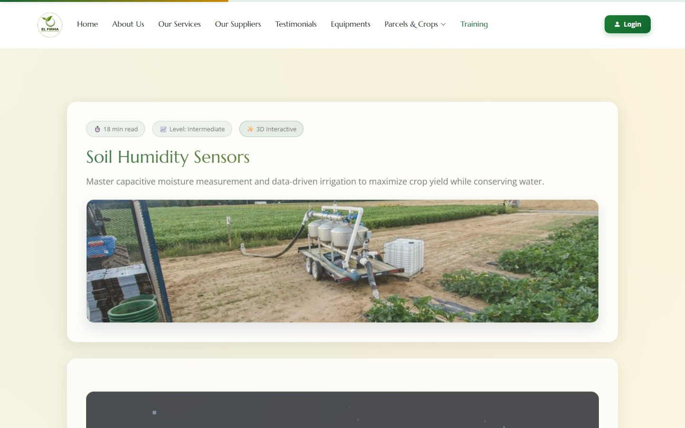 |

> All screenshots live in [`demo/screenshots/`](demo/screenshots/).

---

## ✨ Feature Highlights

<table>
<tr>
<td width="50%">

### 🌱 Agricultural Core
- **Parcel & Crop Management** — Track land parcels with GPS coordinates, soil types, and full crop lifecycle (planting → harvest)
- **Livestock & Animal Management** — Manage herds, individual animals, health records, and vaccination schedules
- **Smart Irrigation** — Automated irrigation event scheduling and monitoring
- **Crop Recommendation Engine** — ML-based optimal crop suggestions from soil & climate data

</td>
<td width="50%">

### 🤖 AI & Intelligence
- **RAG Chatbot** — Retrieval-Augmented Generation with Gemini Flash LLM
- **Predictive Maintenance** — ML forecasting of equipment failures before they happen
- **3D Livestock Models** — Generate 3D animal visualizations via Tripo3D API
- **Voice & Gesture Commands** — Accessibility-first hands-free navigation
- **Animal DNA Sex Detection** — DNA sequence analysis for livestock breeding

</td>
</tr>
<tr>
<td width="50%">

### 🔐 Security & Authentication
- **Fingerprint Biometrics** — ZKFinger SDK bridge (Java) for enrollment & verification
- **Face ID** — Python-based facial recognition (threshold: 0.28)
- **Two-Factor Auth (OTP)** — TOTP via RFC 6238
- **OAuth 2.0** — Google & GitHub single sign-on
- **reCAPTCHA** — Bot protection on all forms

</td>
<td width="50%">

### 🏪 Supply Chain & Commerce
- **Supplier Analytics** — Scoring, performance metrics, and contract tracking
- **Order Management** — Full order lifecycle with cart, checkout & Stripe payments
- **Contract PDF Generation** — Auto-generated supplier contracts with DOMPDF
- **Meeting Scheduling** — Calendar + Jitsi/Zoho video integration for suppliers
- **Multi-currency Support** — Live exchange rate conversion

</td>
</tr>
<tr>
<td width="50%">

### 🎓 Training & Certification
- **9 Interactive Lessons** — Sensors, AI, and maintenance with 3D models and inline knowledge-checks
- **Certification Exam** — 30-question quiz, 70% pass mark
- **Verifiable PDF Certificate** — Auto-generated with a QR verification link
- **Progress Tracking** — Per-user lesson completion and scores

</td>
<td width="50%">

### 📡 Communications & Reporting
- **SMS Alerts** — Twilio vaccination reminders, capacity & maintenance alerts
- **Email Notifications** — SendGrid / Resend transactional emails
- **Firebase Push Notifications** — Real-time mobile sync
- **PDF & Excel** — DOMPDF reports + PHPSpreadsheet import/export
- **ChartJS Dashboards** — Live KPI charts with Symfony UX

</td>
</tr>
</table>

---

## 🛠 Tech Stack

### Backend
| Technology | Version | Purpose |
|---|---|---|
| **PHP** | `≥ 8.1` | Runtime language |
| **Symfony** | `6.4 LTS` | Web framework |
| **Doctrine ORM** | `3.x` | Database abstraction & migrations |
| **MySQL / MariaDB** | `8.0 / 10.4+` | Primary relational database |
| **Symfony Messenger** | `6.4` | Async message queue |
| **DOMPDF** | `3.1` | PDF generation |
| **PHPSpreadsheet** | `5.6` | Excel/CSV import & export |
| **VichUploaderBundle** | `2.9` | File upload management |
| **KnpPaginatorBundle** | `6.10` | List pagination |
| **Firebase Bundle** | `3.1` | Mobile backend & push notifications |
| **OTPHP** | `11.4` | TOTP two-factor authentication |
| **endroid/qr-code** | `6.0` | QR code generation |

### Frontend
| Technology | Purpose |
|---|---|
| **Bootstrap 5.3** | Responsive UI framework |
| **Stimulus + Turbo (Symfony UX)** | SPA-like interactions without full reloads |
| **Symfony UX ChartJS** | Data visualization |
| **Three.js** | Interactive 3D sensor & livestock models |
| **AOS · Swiper · GLightbox** | Animations, carousels, lightbox |
| **Twig 3** | Server-side templating |

### AI / Python Services
| Service | Folder | Technology | Purpose |
|---|---|---|---|
| **RAG Chatbot Engine** | `rag/` | Python + Gemini Flash | Agricultural Q&A chatbot |
| **Crop Recommender** | `scripts/ml/`, `ml/` | scikit-learn (GradientBoosting) | ML-based crop selection |
| **Face ID Service** | `scripts/faceid/` | Python + face_recognition | Biometric face authentication |
| **Chatbot / Intent NLP** | `chatbot_ai/`, `ai_service/` | scikit-learn NaiveBayes | Voice / gesture intent detection |

### Java Service
| Service | Folder | Technology | Purpose |
|---|---|---|---|
| **Fingerprint Bridge** | `fingerprint/` | Java + ZKFinger SDK | Fingerprint enrollment & matching |

---

## 🏗 System Architecture

```
┌─────────────────────────────────────────────────────────────────┐
│                          EL FIRMA                                │
│                    Symfony 6.4 Application                        │
├──────────────┬───────────────┬──────────────┬────────────────────┤
│   Web Layer  │ Service Layer │  Data Layer  │  External Services  │
│              │               │              │                     │
│  Controllers │  Business     │ Doctrine ORM │  Firebase RT DB     │
│  Twig Views  │  Logic        │ MySQL 8.0    │  Twilio / Resend    │
│  Symfony UX  │  AI / ML glue │ Migrations   │  Stripe Payments    │
├──────────────┴───────────────┴──────────────┴────────────────────┤
│                      Optional Microservices                       │
│                                                                   │
│   [Python] rag/ · scripts/ml/ · scripts/faceid/ · chatbot_ai/     │
│   [Java]   fingerprint/  (ZKFinger SDK)                           │
└─────────────────────────────────────────────────────────────────┘
```

---

## ⚡ Quick Start (TL;DR)

> Goal: a fresh machine running the **core web app in under 10 minutes**.
> The AI/biometric microservices are **optional** — the app runs without them.

```bash
# 1. Clone
git clone https://github.com/YoussefAbbes/Esprit-PIDEV-WEB-3A3-2026-ELFIRMA.git
cd Esprit-PIDEV-WEB-3A3-2026-ELFIRMA

# 2. Install PHP dependencies
composer install

# 3. Configure environment (fill in your own values)
cp .env.example .env.local

# 4. Create the database & run migrations
php bin/console doctrine:database:create
php bin/console doctrine:migrations:migrate --no-interaction

# 5. Launch
symfony serve            # or: php -S localhost:8000 -t public/
```

Then open **http://localhost:8000**.

---

## 🚀 Getting Started

### Prerequisites

| Requirement | Version | Needed for |
|---|---|---|
| **PHP** | `≥ 8.1` (ext: `pdo_mysql`, `intl`, `mbstring`, `gd`, `zip`, `curl`) | Core app |
| **Composer** | `≥ 2.0` | PHP dependencies |
| **MySQL / MariaDB** | `8.0` / `10.4+` | Database |
| **Symfony CLI** | latest *(optional)* | `symfony serve` |
| **Python** | `≥ 3.10` | AI / ML features *(optional)* |
| **Java JRE** | `≥ 11` | Fingerprint bridge *(optional)* |

### Installation — Core App (required)

**1. Clone & install**
```bash
git clone https://github.com/YoussefAbbes/Esprit-PIDEV-WEB-3A3-2026-ELFIRMA.git
cd Esprit-PIDEV-WEB-3A3-2026-ELFIRMA
composer install
```

**2. Configure environment**
```bash
cp .env.example .env.local
# Edit .env.local — at minimum set DATABASE_URL.
# Keep all real secrets in .env.local ONLY (it is git-ignored).
```

**3. Database**
```bash
php bin/console doctrine:database:create
php bin/console doctrine:migrations:migrate --no-interaction
```

**4. Run**
```bash
symfony serve
# or, without the Symfony CLI:
php -S localhost:8000 -t public/
```

| Interface | URL |
|---|---|
| Public website | http://localhost:8000 |
| Admin dashboard | http://localhost:8000/elfirma |
| Training module | http://localhost:8000/training |
| Login | http://localhost:8000/login |

### Installation — Optional AI / Biometric Services

These power the chatbot, crop recommender, face ID and fingerprint features. The app degrades gracefully when they are not running.

```bash
# Python: create a virtualenv and install per-service requirements
python -m venv .venv
.venv\Scripts\activate          # Windows
# source .venv/bin/activate     # Linux / macOS

pip install -r rag/requirements-rag.txt        # RAG chatbot
pip install -r scripts/faceid/requirements.txt # Face ID  (if present)
```

> Each AI folder (`rag/`, `scripts/ml/`, `scripts/faceid/`, `chatbot_ai/`) contains its own README / requirements with exact run commands. See [Machine Learning Models & Datasets](#-machine-learning-models--datasets).

---

## 🔑 Environment Variables

All variables are documented in **[`.env.example`](.env.example)**. Copy it to `.env.local` and fill in your own values:

```bash
cp .env.example .env.local
```

> ⚠️ **Never commit real secrets.** `.env.local` is git-ignored. Real API keys, passwords and DSNs must live there (or in real environment variables) — never in a committed file. See the [Symfony secrets guide](https://symfony.com/doc/current/configuration/secrets.html).

Key groups: `APP_*`, `DATABASE_URL`, `MAILER_*`, `TWILIO_*`, `STRIPE_*`, `RAG_* / OPENAI_* / OPENROUTER_*`, `TRIPO3D_*`, `FACE_ID_*`, OAuth (`GOOGLE_*`, `GITHUB_*`), `RECAPTCHA_*`, and the agriculture APIs (`TREFLE_*`, `USDA_*`, `OPENWEATHER_*`, `PIXABAY_*`, `MAPTILER_*`).

---

## 🗂 Module Overview

### 🌐 Public Website (`/`)
Customer-facing site: hero carousel, service catalog, product & livestock showcase, team pages, blog, testimonials, and contact form.

### 🖥 Admin Dashboard (`/elfirma`)

| Module | Route | Features |
|---|---|---|
| 📊 **Dashboard** | `/elfirma` | KPI overview, ChartJS analytics |
| 👥 **Users** | `/elfirma/utilisateurs` | User management, roles, 2FA status |
| 🗺 **Parcels & Crops** | `/elfirma/parcelles-cultures` | Map view, crop lifecycle, CSV/XLSX import, recommendation engine |
| 🐄 **Livestock & Animals** | `/elfirma/animaux-elevages` | Herd management, vaccination, 3D modeling, DNA detection |
| 📦 **Products** | `/elfirma/produits` | Inventory, auto-image fetch |
| 🛒 **Orders** | `/elfirma/produits-commandes` | Cart, Stripe checkout |
| 🔧 **Equipment** | `/elfirma/equipements-maintenance` | Asset tracking, predictive maintenance |
| 🤝 **Suppliers & Contracts** | `/elfirma/fournisseurs-contrats` | Scoring, contract PDF, meetings |
| 📋 **Complaints** | `/elfirma/reclamations` | Tracking, resolution workflow |
| 🎓 **Training** | `/training` | Lessons, exam, certificate |

---

## 🧠 AI & Intelligence

### RAG Chatbot
A **Retrieval-Augmented Generation** pipeline: it retrieves relevant context from the farm knowledge base, then queries **Google Gemini Flash** for natural-language answers.

```
User Query → Document Retrieval (Top-K=5) → Gemini Flash LLM → Response
```

### Crop Recommendation Engine
Input soil & climate parameters → ML-powered crop recommendation with confidence and top-3 alternatives.

| Input Feature | Description |
|---|---|
| N / P / K | Nitrogen, Phosphorus, Potassium (mg/kg) |
| temperature | Average temperature (°C) |
| humidity | Relative humidity (%) |
| ph | Soil pH |
| rainfall | Rainfall (mm) |

> Falls back to a profile-scoring algorithm if the Python model is unavailable. Full details and metrics below.

### Predictive Maintenance
Analyzes equipment age, service hours and history to **predict the next maintenance window** before a breakdown, generating calendar events and SMS alerts.

### Voice & Gesture Assistant
Hands-free catalog navigation, cart and checkout, plus supplier-form dictation, built on a `NaiveBayesClassifier` intent model.

### 3D Livestock Visualization
Generate 3D animal models from a text/image prompt via the **Tripo3D API**, viewable in an interactive Three.js viewer.

---

## 🤖 Machine Learning Models & Datasets

> Per the ESPRIT AI-publication rules: this section documents the Python version, datasets, models, and reproducible performance metrics.

### Environment
- **Python:** `≥ 3.10` (tested on 3.13)
- **Core libs:** scikit-learn, pandas, numpy, joblib (+ Gemini SDK for the RAG chatbot)
- Pinned requirements: [`rag/requirements-rag.txt`](rag/requirements-rag.txt) · [`rag/requirements-lock.txt`](rag/requirements-lock.txt)

### Crop Recommendation Model

| Item | Value |
|---|---|
| **Task** | Multi-class classification (22 crops) |
| **Dataset** | `Crop_recommendation.csv` — 2,200 samples, 7 features (Kaggle *Crop Recommendation Dataset*) |
| **Split** | 1,320 train / 440 validation / 440 test (seed 42) |
| **Selected model** | **GradientBoostingClassifier** (best validation macro-F1) |
| **Test accuracy** | **98.86%** |
| **Test macro-F1** | **98.87%** |
| **Artifacts** | [`ml/crop_recommendation/best_model.joblib`](ml/crop_recommendation/best_model.joblib) (~6 MB) + [`model_metadata.json`](ml/crop_recommendation/model_metadata.json) |

**Model comparison (validation set):**

| Model | Accuracy | Macro-F1 |
|---|---|---|
| RandomForest | 99.09% | 99.09% |
| **GradientBoosting** ✅ | **99.55%** | **99.55%** |
| ExtraTrees | 98.86% | 98.86% |

**Top feature importances:** humidity (24.6%) · rainfall (23.4%) · K (18.5%) · P (12.7%) · N (11.7%).

**Reproduce — train:**
```bash
python scripts/ml/train_crop_recommendation.py \
  --dataset Crop_recommendation.csv \
  --model-output ml/crop_recommendation/best_model.joblib \
  --metadata-output ml/crop_recommendation/model_metadata.json
```

**Reproduce — single inference:**
```bash
python scripts/ml/crop_recommendation_infer.py \
  --model ml/crop_recommendation/best_model.joblib \
  --metadata ml/crop_recommendation/model_metadata.json \
  --input-json "{\"N\":90,\"P\":42,\"K\":43,\"temperature\":21,\"humidity\":82,\"ph\":6.5,\"rainfall\":203}"
```

An exploratory notebook is available at [`notebooks/crop_recommendation_workflow.ipynb`](notebooks/crop_recommendation_workflow.ipynb).

### Other models
- **Chatbot / intent classifier** — `chatbot_ai/model/` (`rf_model.pkl`, `vectorizer.pkl`, `label_encoder.pkl`, `responses.pkl`).
- **Voice / gesture intent** — `src/AI/` (NaiveBayes) trained via `App\Command\TrainVoiceIntentModelCommand`.

> **Note on model size:** all committed models are small (< 25 MB), so they are kept in-repo for one-command reproducibility. Larger models (> 100 MB) must instead be hosted externally (Hugging Face / Drive) with a download script — none apply here.

---

## 🔐 Biometric Authentication

### Fingerprint Recognition
```
Browser ──► Symfony Controller ──► HTTP ──► Java Bridge (fingerprint/)
                                              └──► ZKFinger SDK · Enroll / Match
```

| Endpoint | Action |
|---|---|
| `POST /fingerprint/enroll/start` | Start enrollment |
| `POST /fingerprint/enroll/capture` | Capture sample |
| `POST /fingerprint/verify` | Verify against template |
| `POST /fingerprint/identify` | Identify user |

### Face ID
```
Browser ──► Symfony Controller ──► HTTP ──► Python Service (scripts/faceid/, port 8765)
                                              └──► face_recognition · Encode / Compare (threshold 0.28)
```

---

## 🔗 API Integrations

```
┌─────────────────────────────────────────────────────────────┐
│                    External API Map                          │
├──────────────┬──────────────────────────────────────────────┤
│ 🌱 Agri      │ Trefle (plants) · USDA (data) · OpenWeather   │
│ 🤖 AI        │ Google Gemini · OpenAI · OpenRouter · Tripo3D │
│ 💬 Comms     │ Twilio SMS · SendGrid/Resend · Jitsi/Zoho     │
│ 🗺 Geo       │ Nominatim (OSM) · MapTiler                    │
│ 💳 Finance   │ Stripe Payments · Exchange Rates API          │
│ 🔐 Auth      │ Google OAuth2 · GitHub OAuth2 · reCAPTCHA     │
│ 📸 Media     │ Pixabay Images · Firebase Storage             │
│ 🛡 Safety    │ API-Ninjas Profanity Filter                   │
└──────────────┴──────────────────────────────────────────────┘
```

---

## 🗄 Database Schema

Doctrine entities across domain clusters:

<details>
<summary><strong>View entity relationships</strong></summary>

```
AGRICULTURAL CORE
Parcelle ──[1:N]──► Culture            (GPS coords, soil type, status)
Livestock ──[1:N]──► Animal ──[1:N]──► Vaccination

EQUIPMENT
Equipement ──[1:N]──► Maintenance      (service hours, predictive alerts)

COMMERCE
Fournisseur ──┬──[1:N]──► Contrat
              ├──[1:N]──► Meeting
              └──[1:N]──► Commande
Produit ──[M:N]──► Commande
Categorie ──[1:N]──► Produit

USERS / TRAINING / FEEDBACK
Utilisateur ──[1:N]──► Reclamation     (role, biometric templates, OAuth IDs)
UserProgress                            (training lessons, quiz score, certificate)
Rating · Notification · IrrigationEvent
```

</details>

---

## 📁 Project Structure

```
elfirma/
├── config/                  # Symfony configuration (packages, routes)
├── migrations/              # Doctrine database migrations
├── public/                  # Web root
│   ├── assets/              # CSS, JS, images, vendor libs
│   └── images/lessons/      # Training lesson photos
├── src/
│   ├── Controller/          # HTTP controllers
│   ├── Entity/              # Doctrine entities
│   ├── Repository/          # Data access layer
│   ├── Service/             # Business services
│   ├── Security/            # Auth providers, OAuth handlers
│   ├── AI/                  # Intent classifiers / NLP
│   └── Command/             # Console commands (e.g. model training)
├── templates/               # Twig views (public, admin, training, emails)
├── ml/crop_recommendation/  # Trained crop model + metadata
├── scripts/
│   ├── ml/                  # Crop training & inference scripts
│   └── faceid/              # Python Face ID service
├── rag/                     # Python RAG chatbot (+ requirements)
├── chatbot_ai/ · ai_service/# Intent / chatbot NLP services
├── fingerprint/             # Java ZKFinger SDK bridge
├── notebooks/               # Jupyter exploration notebooks
├── docs/                    # Technical documentation
├── demo/                    # Screenshots / demo video
├── .env.example             # Environment variable template
└── README.md
```

---

## 🧪 Running Tests

```bash
# PHPUnit test suite
php bin/phpunit

# Static analysis (PHPStan)
vendor/bin/phpstan analyse src
```

---

## 🤝 Contributing

1. **Fork** the repository
2. **Create** a feature branch — `git checkout -b feature/your-feature-name`
3. **Commit** with [Conventional Commits](https://www.conventionalcommits.org/) — `git commit -m 'feat: add amazing feature'`
4. **Push** — `git push origin feature/your-feature-name`
5. **Open** a Pull Request against `main`

| Prefix | Use for |
|---|---|
| `feat:` | New feature |
| `fix:` | Bug fix |
| `refactor:` | Code restructuring |
| `docs:` | Documentation |
| `test:` | Tests |
| `chore:` | Build / tooling |

---

## 👥 Team

Built by engineering students at **ESPRIT School of Engineering**:

<div align="center">

| | Contributor | GitHub |
|---|---|---|
| 🧑‍💻 | **Youssef Abbes** | [@YoussefAbbes](https://github.com/YoussefAbbes) |
| 🧑‍💻 | **Mohamed Yassine Labidi** | [@yassine241206](https://github.com/yassine241206) |
| 🧑‍💻 | **Ahmed Zouari** | [@ahmedzouari-Xa](https://github.com/ahmedzouari-Xa) |
| 🧑‍💻 | **Nourhene Zouabi** | [@nourhene-zouabi](https://github.com/nourhene-zouabi) |
| 🧑‍💻 | **Ikam** | [@Ikam2](https://github.com/Ikam2) |

</div>

> 🎓 **ESPRIT — École Supérieure Privée d'Ingénierie et de Technologies**
> 3rd Year Engineering · PIDEV · Group 3A3 · 2025–2026

---

## 📄 License

This is an **academic project** developed for ESPRIT School of Engineering (PIDEV 2025–2026). It is provided for **educational purposes**; reuse beyond academic evaluation requires the authors' permission.

---

<div align="center">

**Built with 💚 and a lot of ☕ by Team 3A3 at ESPRIT**

*Turning the age-old practice of farming into a data-driven, AI-powered enterprise.*

</div>
